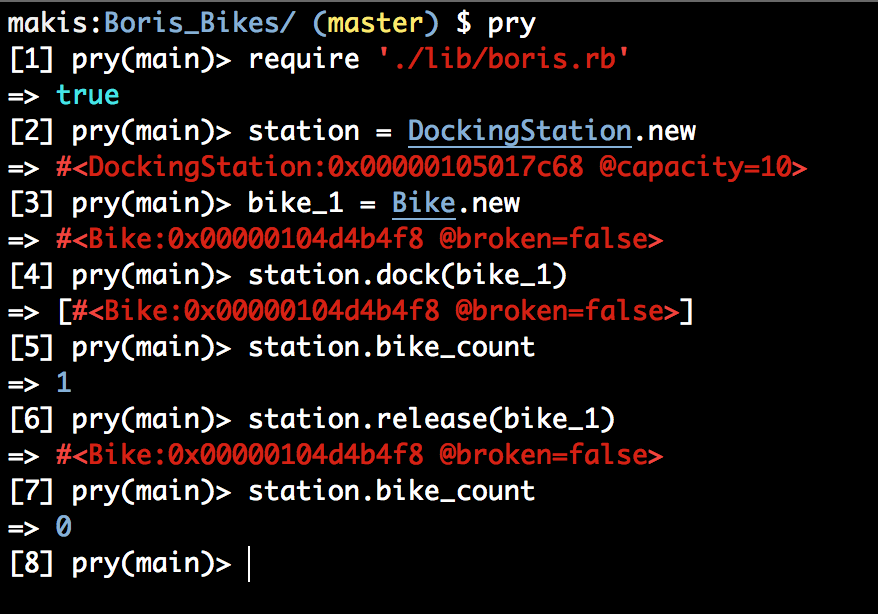

Boris Bikes
=============

### Week 3 Project, at [Makers Academy](http://www.makersacademy.com/).


The goal is to create a system with the following functionality:

- Ability to create a docking station that with a specified capacity
    - station can dock bikes
    - station can release bikes
- Ability to create a bike
    - bike can be broken
    - bike can be fixed
- Ability to create a van
    - van can take broken bikes from station to garage and vice verca
- Ability to create a garage
    - garage can accept broken bikes from a van
    - garage can fix the bikes and return them to the van

How to use
----------

Clone the repository with:
```
git clone git@github.com:Maikon/Boris_Bikes.git
```
Switch to it with:
```
cd Boris_Bikes
```
Then open irb and require the boris.rb file. The below shows the process (I use [Pry](http://pryrepl.org/) instead of IRB):




If you have rspec installed, you can also run the tests with:
```
rspec
```
